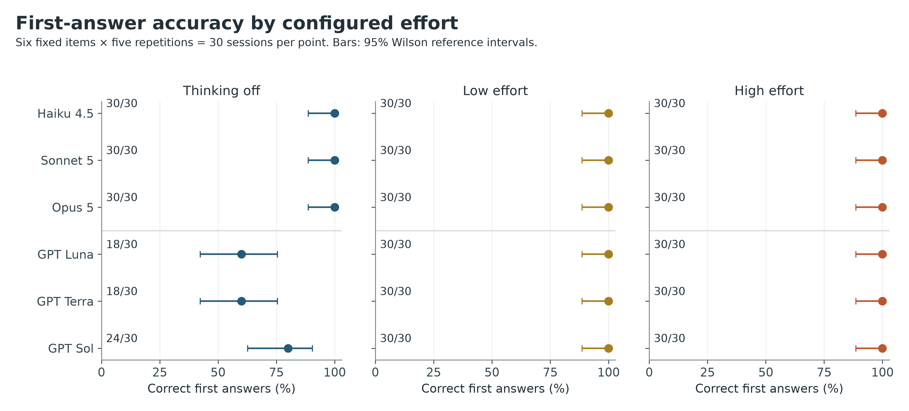
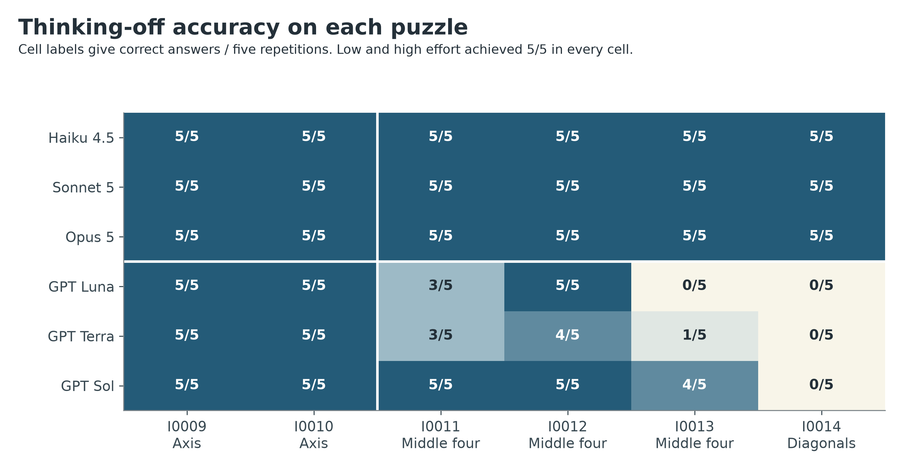
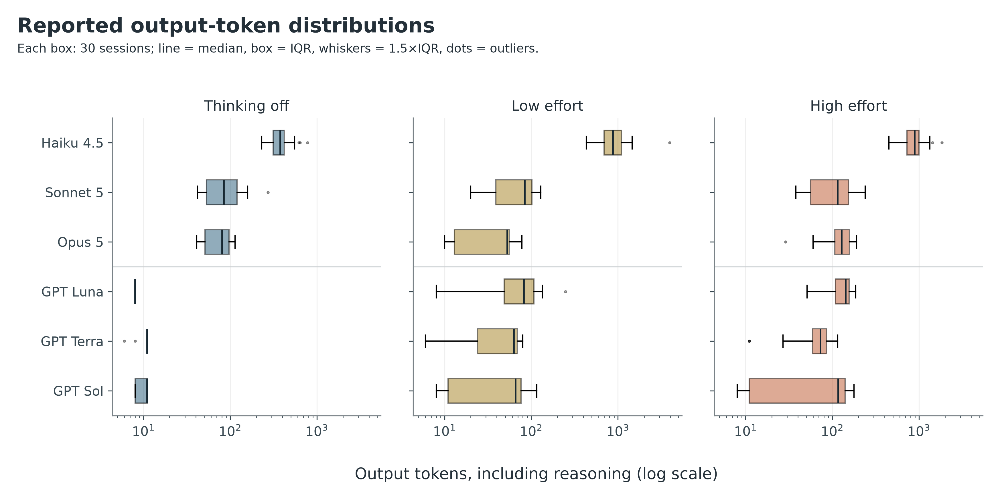
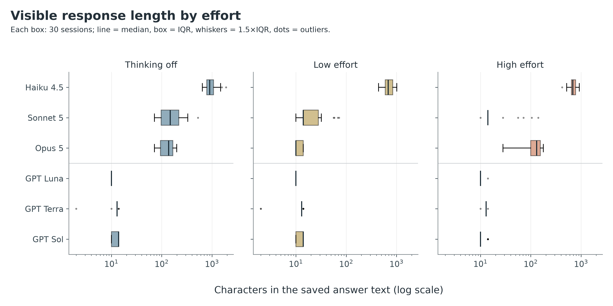
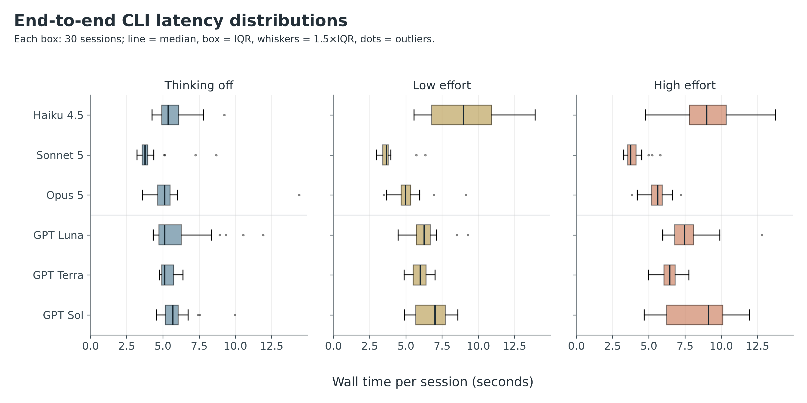
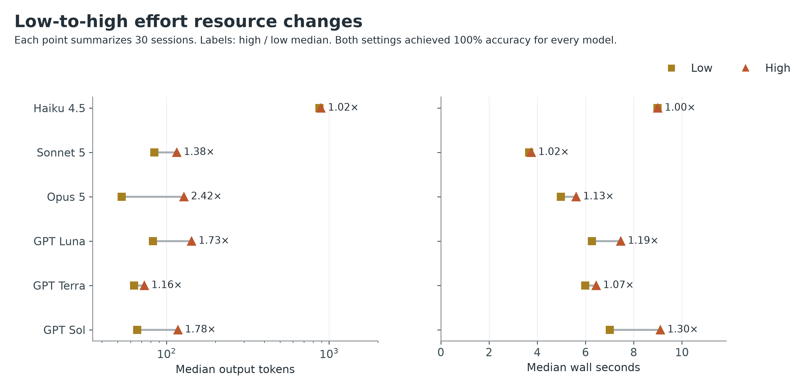
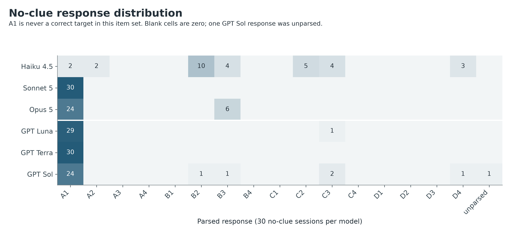
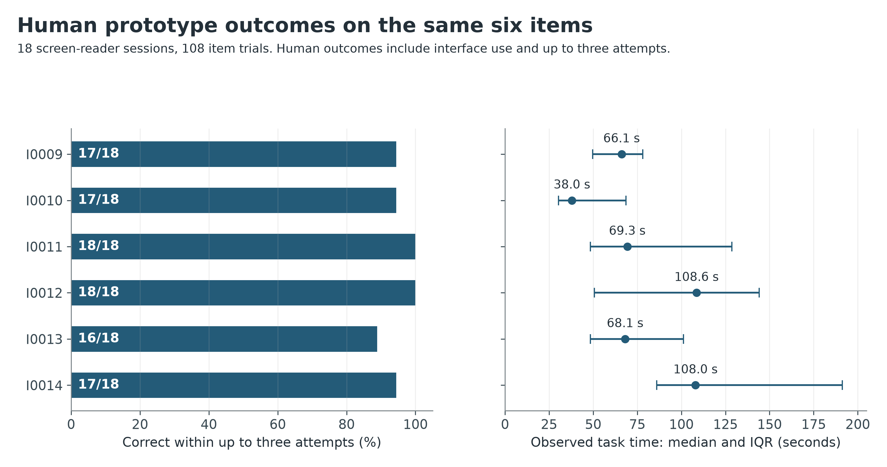

# Reasoning Effort and Failure Modes in a Text-Based Grid CAPTCHA: A Comparative Benchmark of Claude and GPT Subscription Models

**Article type:** Original empirical study; retrospective comparative analysis.  
**Analysis snapshot:** 10 September 2026.  
**Status:** Manuscript draft for author review; not a peer-reviewed publication.  
**Authors, affiliations, corresponding author and target journal:** To be supplied by the research team.

## Abstract

**Background:** Text-based constraint puzzles may reduce the perceptual barriers of conventional CAPTCHA tasks, but accessibility does not establish resistance to automated solving. This study examines six fixed grid puzzles used in the Touchstone prototype and compares model performance under different configured reasoning settings.

**Methods:** Retained Claude Code and Codex subscription logs were reanalysed offline. Three Claude models and three configured GPT models each completed six canonical 4 × 4 puzzles five times in four conditions: thinking off, low effort, high effort, and a high-effort no-clue control. The resulting dataset comprised 720 completed sessions: 540 with clues and 180 controls. Every evaluated session allowed one response without corrective feedback. Answers were scored against the repository key and checked with a separate deterministic solver. Accuracy, token counters, wall latency, visible-response characteristics and control-response distributions were compared descriptively. Existing data from 18 human screen-reader sessions provided secondary context, with different interaction and attempt allowances.

**Results:** Claude achieved 270/270 correct clue-bearing responses. GPT achieved 240/270: thinking-off accuracy was 18/30 (60%) for Luna, 18/30 (60%) for Terra and 24/30 (80%) for Sol. Every model achieved 30/30 under both low and high effort using the original parser. All 30 incorrect responses came from GPT thinking-off sessions and violated a region exclusion while satisfying the row and column exclusions. High effort produced no observed accuracy gain over low effort; GPT median output-token ratios were 1.73, 1.16 and 1.78, respectively. Controls yielded 1/180 correct, but strongly nonuniform guesses limited their value as leakage diagnostics. Requiring an explicit answer marker reduced Terra's off and low scores to 17/30 and 28/30. Human prototype accuracy was 103/108 item trials (95.37%) within up to three attempts; 14/18 sessions solved all six items.

**Conclusions:** These six puzzles were consistently solvable by all tested models with low configured effort under semantic cell-answer scoring. Region exclusions exposed a reproducible failure pattern in GPT thinking-off responses. The evidence supports a bounded conclusion about this fixed task set and these subscription configurations; it does not establish a general model ranking, a human–machine computational asymmetry, or deployable CAPTCHA security. Cross-provider reasoning settings, response styles, telemetry and collection conditions were not standardized.

**Keywords:** CAPTCHA; accessibility; constraint satisfaction; language models; reasoning effort; Claude; GPT; benchmark integrity; evaluation methodology.

## 1. Introduction

### 1.1 Problem and motivation

A CAPTCHA is intended to distinguish human users from automated solvers. The original formulation framed this as a task accessible to humans but difficult for contemporary computer programs. That distinction is an empirical property that can change with solver capability; merely presenting a puzzle does not establish it. [von Ahn et al., 2003](https://www.iacr.org/archive/eurocrypt2003/26560294/26560294.pdf)

Accessibility introduces a separate requirement. A verification challenge can impede legitimate users who cannot perceive or operate its interface. W3C documents accessibility problems across CAPTCHA designs and discusses alternatives. The present prototype responds to this concern with text clues and keyboard-operable answer controls. This study tests automated solving of those clues; it does not certify compliance or universal accessibility. [W3C, *Inaccessibility of CAPTCHA*](https://www.w3.org/TR/turingtest/)

The repository's proposed mechanism is a hidden-circle task on a labelled grid. Each negative clue removes candidate locations until one remains. The motivating computational-asymmetry claim credits humans with a small number of conceptual elimination steps and assumes that a model would inspect many cells. That claim requires direct measurement. Fluent deduction, correct output, a token count and a theoretical cell-check annotation are different observations.

### 1.2 Research questions

1. **RQ1 — Solvability:** How accurately do the retained Claude and GPT configurations solve the same six puzzles on the first response?
2. **RQ2 — Configured effort:** How do off, low and high settings relate to accuracy, generated-token counters and measured latency?
3. **RQ3 — Failure structure:** Which items and constraints account for incorrect responses?
4. **RQ4 — Benchmark integrity:** What evidence supports prompt isolation and what remains uncertain about answer leakage, parsing and model identity?
5. **RQ5 — Interpretation:** What can the benchmark establish about the prototype when considered alongside the available human study?

The analysis is exploratory and retrospective. No public preregistration or prospectively timestamped statistical analysis plan is supplied. The saved GPT collection manifest establishes a run plan; it is not a registration of this comparative manuscript or its added sensitivity analyses.

## 2. Materials and Methods

### 2.1 Repository scope and source hierarchy

The primary evidence is the completed session-level JSONL in `analysis/model_benchmark/output`. Source code establishes what the retained harnesses were designed to send and record. Existing CSV summaries are reconciliation targets, not a substitute for raw-session regrading. The older [Claude report](MODEL_BENCHMARK_REPORT.md) and [GPT summary](output/gpt_cli_arm_tables.md) provide context; conflicting methodological statements are resolved against the implementation and retained data.

**Table 1. Evidence included and excluded.**

| Source | Role | Inclusion decision |
| --- | --- | --- |
| [Claude raw sessions](output/cli_arm_runs.jsonl) | 360 completed, non-practice, harness-version-2 sessions | Primary Claude evidence |
| [GPT raw sessions](output/gpt_cli_arm_runs.jsonl) | 363 records: 360 completions and three recovered collection errors | Completed results for performance; errors retained for operational accounting |
| [GPT manifest](output/gpt_cli_arm_runs.manifest.json) and [prompt export](gpt_inputs.json) | Plan, hashes, CLI version, isolation audits and readiness probes | Provenance and integrity checks; probes excluded from puzzle performance |
| [Canonical item bundle](../../data/instances.json), [item loader/solver](items.py), [prompts](prompts.py) | Task specification, key, independent constraint evaluation and prompt construction | Offline validation only |
| [Human cleaned snapshot](../rohan_study_report/output/clean_unique_trials.csv) and its [source notes](../rohan_study_report/source_notes.md) | Existing human prototype outcomes | Aggregate contextual analysis; no participant identifiers exported here |
| `output/provisional_incomplete/` | Superseded summaries from incomplete GPT collection | Excluded; not pooled with the completed run |
| `run_benchmark.py` and `analyze_benchmark.py` API design | Separate design with different prompts and up to three attempts | No retained `output/runs.jsonl` dataset; no API-arm results or cost estimates treated as observations |
| Historically discarded Claude runs described in source comments | Narrative about earlier leakage, model attribution and process problems | Not part of retained data; incidents are not independently re-audited from missing raw traces |

The application resolves the practice item and six-item canonical set in [lib/instances.ts](../../lib/instances.ts), presents them in [Runner.tsx](../../app/run/%5Btoken%5D/Runner.tsx), and derives human durations in [the trial endpoint](../../app/api/trial/route.ts). The benchmark reproduces the text task, not the full browser interaction. Original raw benchmark files were read without modification during this report analysis.

### 2.2 Puzzle definition and item set

Each evaluated puzzle has 16 candidate cells: columns A–D and rows 1–4. Four natural-language negative clues define excluded cells. The answer is the sole cell surviving their conjunction. Formally, for candidate set G and exclusions E₁ through E₄, the valid set is `G \ (E₁ ∪ E₂ ∪ E₃ ∪ E₄)`. The independent solver enumerates the 16 candidates, interprets the clue strings, and confirms that this set contains exactly the stored answer for all six items and the practice item. This validates uniqueness and key agreement; it does not establish all possible natural-language interpretations or puzzle difficulty.

**Table 2. Canonical task inventory.** All items have grid size 4 × 4, four clues and repository difficulty band 2. Full clue wording appears in Appendix A.

| Fixed position | Item | Clue structure | Correct target | Candidate ambiguity resolved by the region clue |
| --- | --- | --- | --- | --- |
| 1 | I0009 | Row and column exclusions only | C2 | None; independent axis elimination suffices |
| 2 | I0010 | Row and column exclusions only | C3 | None; independent axis elimination suffices |
| 3 | I0011 | Axis exclusions + not in middle four boxes | B4 | B2 versus B4 |
| 4 | I0012 | Axis exclusions + not in middle four boxes | D3 | B3 versus D3 |
| 5 | I0013 | Axis exclusions + not in middle four boxes | D2 | C2 versus D2 |
| 6 | I0014 | Axis exclusions + not on either diagonal | C4 | C2 versus C4 |

The practice item PRAC01 was excluded from performance counts. Human participants received a practice stage; evaluated model sessions were fresh, with no preceding practice conversation. The six item texts and their ordinal headings were fixed. They are not a random sample of all potential puzzles. Two items are axis-only, three exclude the middle four cells and one excludes both diagonals; six repetitions of a template would not create six independent task families.

The target distribution is also restricted: the six correct coordinates are distinct, A1 never occurs, and the formatting example B3 is never a correct canonical target. Only one grid size was tested. Metadata such as `model_cell_checks=48`, `human_sweeps=3` and `asymmetry_ratio=16` are design annotations, not measurements of the tested solvers' internal operations.

### 2.3 Models and subscription access

**Table 3. Model identifiers and provenance.** Short GPT labels in figures are aliases for the exact configured IDs below, not independent product names.

| Figure label | Configured selection / retained identity | Evidence and limit |
| --- | --- | --- |
| Haiku 4.5 | `haiku` → `claude-haiku-4-5-20251001` | Matching main-model entry in retained Claude `model_usage`; all 120 sessions marked verified |
| Sonnet 5 | `sonnet` → `claude-sonnet-5` | Matching main-model entry in retained Claude `model_usage`; all 120 sessions marked verified |
| Opus 5 | `opus` → `claude-opus-5` | Matching main-model entry in retained Claude `model_usage`; all 120 sessions marked verified |
| GPT Luna | `gpt-5.6-luna` | Configured ID checked by local serialized-request audit and subscription probes; independent server-reported ID unavailable |
| GPT Terra | `gpt-5.6-terra` | Same verification scope; `model_reported` remains null in saved results |
| GPT Sol | `gpt-5.6-sol` | Same verification scope; `model_reported` remains null in saved results |

Claude was invoked through Claude Code subscription access. GPT was invoked through Codex using ChatGPT subscription authentication, recorded as `chatgpt` in the manifest, with `codex-cli 0.153.4`. No separately billed OpenAI API run was used for the retained GPT benchmark. Subscription authentication is an access route; it does not imply a measured zero cost per solved puzzle. Exact subscription tier, quota allocation and attributable monetary cost were not recorded.

GPT completed-session start timestamps run from `2026-09-10T06:59:51.783623+00:00` to `2026-09-10T11:51:22.691021+00:00`. This is a collection window, not the sum of inference durations. Three quota-related error records were followed by successful completion of their planned session keys. Claude raw records do not retain a comparable collection timestamp or CLI version. The date-like suffix in a model identifier is not a collection date.

### 2.4 Experimental design and sample accounting

Each vendor contributed `3 models × 4 conditions × 6 items × 5 repetitions = 360` completed sessions. The analytical unit for primary accuracy is one model–condition–item–repetition response. Each model–condition estimate has N = 30. Item-specific estimates within a model–condition have N = 5.

**Table 4. Completed-session flow.**

| Stage or subset | Claude | GPT | Combined |
| --- | --- | --- | --- |
| Retained raw records | 360 | 363 | 723 |
| Recovered collection-error records | 0 | 3 | 3 |
| Unique completed planned sessions | 360 | 360 | 720 |
| Clue-bearing sessions: off + low + high | 270 | 270 | 540 |
| No-clue control sessions | 90 | 90 | 180 |
| Correct clue-bearing responses | 270 | 240 | 510 |
| Correct no-clue responses | 1 | 0 | 1 |
| Completed planned session keys missing | 0 | 0 | 0 |

Transport failures are operational failures, not incorrect puzzle answers. They are excluded from the performance denominator because the plan was completed with one successful response per key; there is no selection among multiple completed answers. The three GPT error records represent 0.83% of its 363 retained attempt records. Collection interruption can still affect timing and service conditions. Summaries in the provisional directory are not additional observations.

Both completed subscription arms used **one independent answer per session and no correctness feedback**. The three-attempt design described elsewhere in the older report belongs to a different, unmeasured API arm. Likewise, model repetition numbers are not retries after an incorrect puzzle answer. The Claude runner iterates sequentially by model, condition, item and repetition. The GPT plan interleaves models and uses three workers, with a resumed collection. Neither run establishes randomized assignment of service time or a matched cross-provider latency experiment. No common sampling temperature, seed or compute budget is certified by the retained logs.

### 2.5 Prompt fidelity and reasoning conditions

The model prompt carries the puzzle heading, preamble, four clues, question, answer-control hint and column/row options from the prototype. The shared instruction text explains the naming convention, includes B3 as an example, and asks for an `ANSWER: <box>` line. The SVG grid is `aria-hidden` in the human interface; the benchmark provides text instead of a screenshot. Content fidelity does not equate visual, auditory and text-token processing demands.

The retained subscription code always uses the instruction produced by `system_prompt("extended_thinking")`, including “Give the answer line at the end of your reply.” It does **not** switch to the API design's stricter `answer_only` prompt for thinking off. The common prompt permits differences in visible working. Claude receives the supplied text as its custom system prompt; the GPT transport installs it as base instructions. The surrounding product implementations are different even when supplied text agrees.

**Table 5. Condition mapping.**

| Analysis condition | Claude setting | GPT setting | Clues | Interpretation |
| --- | --- | --- | --- | --- |
| Thinking off | `MAX_THINKING_TOKENS=0`; no effort flag | Explicit reasoning effort `none` | All four | Recorded reasoning counter is zero; ordinary response generation can still perform reasoning |
| Low effort | `--effort low` | Explicit reasoning effort `low` | All four | Provider-specific low setting; not a fixed or matched token budget |
| High effort | `--effort high` | Explicit reasoning effort `high` | All four | Provider-specific high setting; not guaranteed to use more tokens on every session |
| No-clue control | `--effort high` | Explicit reasoning effort `high` | Replaced by `(none provided)` | Underconstrained task; diagnostic of answer availability and response bias |

All 180 thinking-off sessions across the two vendors reported zero reasoning tokens. Low/high settings may legitimately produce zero reported reasoning on an individual short task; requested effort and realized usage are different variables. No equivalence of Claude and GPT effort labels is assumed.

### 2.6 Answer isolation and leakage audit

Isolation concerns information available to the evaluated solver. The offline analysts and deterministic grader must consult the key after collection. This manuscript and its supplementary analytical files contain answers; future collection should continue to use the allowlisted `gpt_inputs.json` export, never this report as solver context.

**Table 6. Leakage safeguards, retained evidence and limitations.**

| Layer | Claude subscription arm | GPT subscription arm | Interpretation |
| --- | --- | --- | --- |
| Prompt construction | Uses item text and common instruction; no solution field interpolated | Separate preparation exports an explicit whitelist of prompt fields; export checked against source | Intended payloads exclude solutions and earlier results |
| Collection-process knowledge | `load_items()` instantiates objects that include `.solution`, even though prompt code does not use it | Collection imports prompt-only transport and reads the validated export | Claude's claim that the runner “holds no solutions” is too strong; model visibility and process memory must be distinguished |
| Tools and files | `--tools ""`, restricted mode, strict MCP configuration, fresh empty temporary working directory | Tool-disabled model metadata; strict isolated CLI configuration; fresh empty working directory and ephemeral conversation | Controls are implemented in code; an empty directory alone is not filesystem confinement if a tool were available |
| Additional context | Custom system prompt and restricted CLI settings | User/project instructions, agents, skills, plugins, MCP, memory and associated context injection disabled | GPT's local fixture checks serialized input, including empty `additional_tools` |
| Retained runtime evidence | All 360 sessions have one turn and empty permission denials | All 360 sessions have unique threads; validated text/reasoning event streams; zero tool events | Claude summaries are weaker evidence than a retained complete tool-event stream; neither establishes all provider internals |
| Transport audit | No equivalent full request fixture retained | Nine local model/effort request audits plus nine subscription readiness probes in manifest | Local-provider fixture verifies serialization; it is not a capture of authenticated production traffic |
| Grading separation | Correctness attached offline; original grader's control check reports a verdict | Manifest coverage, prompts, event integrity, unique sessions and control gates checked before publication | This reanalysis adds exact 720-key coverage and checks every model control threshold |
| No-clue control | 1/90 correct | 0/90 correct | Compatible with intended isolation but not proof against training contamination or every leak route |

The GPT runner's tool-related catalog override changes tool exposure, not the configured model IDs. The outgoing-request fixture checks empty tools, exact supplied instruction and user text, and absence of a previous response. The real CLI event validator rejects unexpected activity. Source hashes for collection code still match the manifest. This is evidence for the specific audited harness, not a guarantee about every possible future CLI version.

The older Claude source documents a prior file-reading leakage probe and discarded runs. The retained dataset is entirely harness version 2. Because the discarded raw traces are not available in the analysis inputs, their counts and detailed history are not used as new measured results.

### 2.7 Outcome and resource definitions

**Table 7. Metric dictionary.**

| Metric | Definition | Denominator or caveat |
| --- | --- | --- |
| First-answer accuracy | Parsed submitted cell equals independently verified target | Correct / completed clue-bearing sessions; controls separate |
| Item-macro accuracy | Mean of six item accuracies | Equals pooled session accuracy here because every item has five repetitions |
| Parse failure | Original parser returns no cell | Counts as incorrect in a completed session, including controls |
| Marker-required sensitivity | Require a valid `ANSWER:` cell match; disable fallback to a bare cell | A format-compliance sensitivity, not a replacement semantic key |
| Output tokens | Retained Claude top-level usage counter or Codex `turn.completed.usage.output_tokens` | Includes reported reasoning; provider tokenizers/accounting differ |
| Reasoning tokens | Claude `thinking_tokens` or Codex `reasoning_output_tokens` | Reported subset of output; not a cognitive-operation count |
| Non-reasoning output | Per-session output minus reasoning counter | Computed per row before summarizing; not necessarily equivalent to visible text tokens |
| Visible characters | Python string length of saved final answer text | Tokenizer-independent text-length proxy; not latent reasoning length |
| Wall latency | Host time around CLI subprocess invocation | Includes startup, service and transport; concurrency differs |
| Claude API latency | Retained `duration_api_ms` | Secondary within-Claude metric; GPT counterpart unavailable |
| Tokens / correct | Sum of output tokens across completed clue sessions divided by number correct in that group | Includes tokens spent on wrong responses; undefined when zero correct |
| Wall seconds / correct | Sum of session wall seconds divided by number correct | Resource normalization; not elapsed concurrent campaign time or a measured retry policy |
| Enumeration flag | At least ten distinct uppercase A–D/1–4 cell names occur in visible text | Regex heuristic only; cannot observe hidden enumeration |
| Dollar cost / correct | Not measured | No conversion from subscription use or list-price telemetry into actual expenditure |

The original parser selects the last explicit `ANSWER:` cell match, or otherwise the last bare cell mention. Both vendors are scored with the same semantics. A fallback can recover a concise correct answer but can also mistake a contextual example for a submission. Null answers count as failures to solve the fixed target; in an underconstrained control, abstention may be the logically appropriate behavior.

All durations are reported in seconds. Distribution tables use medians and the 25th/75th percentiles, with NumPy's linear quantile interpolation. Output medians retain half-token values instead of the older Claude CSV's integer rounding. Medians of separate components need not add to the median total. Auxiliary Claude model-usage entries are not added to primary output counts; their retained output sum is 3,626 tokens. For Haiku, both primary and `model_usage` output counters are examined because their relationship is not fully explained by the retained data.

### 2.8 Statistical approach and sensitivity analyses

The central estimand is performance on these six equally weighted fixed items under the recorded configurations. Five repeated model responses improve description of repeatability on an item, not coverage of the task population. The same items recur across models and conditions, and human trials recur within participants. Treating all 540 clue sessions as independent sampled puzzles would be pseudoreplication. The general methodological problem is discussed by [Hurlbert, 1984](https://esajournals.onlinelibrary.wiley.com/doi/10.2307/1942661).

For transparency, Figure 1 and Table 8 show two-sided 95% Wilson **reference intervals** for proportions using z = 1.959963984540054. Their formula is `center = (p + z²/(2n))/(1 + z²/n)` and `half-width = z·sqrt(p(1−p)/n + z²/(4n²))/(1 + z²/n)`. They describe a Bernoulli sampling reference and do not account for fixed-item heterogeneity, shared service conditions or generalization to new items. A 30/30 result has a reference interval of 88.65–100%, not proof of perfect future performance. [NIST/SEMATECH, confidence intervals](https://www.itl.nist.gov/div898/handbook/prc/section2/prc241.htm)

No confirmatory vendor-comparison p-values are reported. Formal causal attribution to effort is limited by collection ordering, product defaults and the absence of randomized matched blocks. Added robustness checks cover strict answer-marker scoring, alternative Claude token counters, omission of one item at a time, exact plan coverage, source/prompt checksums, and reconciliation with both vendors' saved summaries. The no-clue threshold of at most 25% is an existing harness diagnostic, not a statistical significance level.

### 2.9 Human contextual dataset

The saved human-study snapshot covers 11–26 August 2026 UTC. Its source analysis retained 127 unique trial rows from 130 raw rows after resolving three duplicates using its documented earliest-record rule. There were 21 sessions overall: 18 complete six-item prototype sessions and 19 baseline sessions, with overlapping but unequal sets. This report reaggregates the 108 prototype trials from the cleaned snapshot; it does not re-import the original workbook or independently reproduce its initial deduplication.

Humans could make up to three attempts and interacted through the interface. Thus human correctness is eventual item success within the allowed attempts, whereas model correctness is first-response success. Human task time runs from item start to final submission/settlement. “Orientation” ends at the earliest retained focus, keydown or pointer signal; “execution” runs from that signal to submission. These event boundaries do not isolate perception, deduction or motor activity.

## 3. Results

### 3.1 Integrity, completeness and overall accuracy

All 720 expected completed keys were present exactly once, with five repetitions per item–model–condition. No practice row entered the performance denominator. All six stored answer-key entries agreed with the independent solver, and all saved vendor condition summaries reconciled with the reanalysis at their original rounding precision. GPT integrity checks confirmed 360 distinct conversation IDs and zero tool events. All thinking-off reasoning counters were zero.

Across the equally weighted tested models, 510/540 clue-bearing sessions were correct (94.44%). Claude contributed 270/270 (100%) and GPT 240/270 (88.89%). These pooled fractions describe the chosen model mixture and conditions; they are not provider-wide success probabilities. Off alone contributed 150/180 (83.33%), whereas low and high each contributed 180/180 (100%) under the original parser.

**Table 8. First-answer accuracy by model and condition.** Each cell covers six items × five repetitions. All low/high reference intervals are 88.65–100%. See Section 3.8 for marker-required sensitivity.

| Model | Off: correct/N (%) | Off: Wilson 95% reference interval | Low: correct/N (%) | High: correct/N (%) |
| --- | --- | --- | --- | --- |
| Haiku 4.5 | 30/30 (100.0) | 88.6–100.0% | 30/30 (100.0) | 30/30 (100.0) |
| Sonnet 5 | 30/30 (100.0) | 88.6–100.0% | 30/30 (100.0) | 30/30 (100.0) |
| Opus 5 | 30/30 (100.0) | 88.6–100.0% | 30/30 (100.0) | 30/30 (100.0) |
| GPT Luna | 18/30 (60.0) | 42.3–75.4% | 30/30 (100.0) | 30/30 (100.0) |
| GPT Terra | 18/30 (60.0) | 42.3–75.4% | 30/30 (100.0) | 30/30 (100.0) |
| GPT Sol | 24/30 (80.0) | 62.7–90.5% | 30/30 (100.0) | 30/30 (100.0) |



**Figure 1.** Correct first responses and Wilson reference intervals. The uncertainty bars are conditional descriptive references; they do not represent uncertainty over the full population of possible grid puzzles.

### 3.2 Item-level accuracy and error localization

**Table 9. Thinking-off correct responses per item.** Every corresponding low/high cell was 5/5 under the original parser.

| Model | I0009 | I0010 | I0011 | I0012 | I0013 | I0014 | All items |
| --- | --- | --- | --- | --- | --- | --- | --- |
| Haiku 4.5 | 5/5 | 5/5 | 5/5 | 5/5 | 5/5 | 5/5 | 30/30 |
| Sonnet 5 | 5/5 | 5/5 | 5/5 | 5/5 | 5/5 | 5/5 | 30/30 |
| Opus 5 | 5/5 | 5/5 | 5/5 | 5/5 | 5/5 | 5/5 | 30/30 |
| GPT Luna | 5/5 | 5/5 | 3/5 | 5/5 | 0/5 | 0/5 | 18/30 |
| GPT Terra | 5/5 | 5/5 | 3/5 | 4/5 | 1/5 | 0/5 | 18/30 |
| GPT Sol | 5/5 | 5/5 | 5/5 | 5/5 | 4/5 | 0/5 | 24/30 |



**Figure 2.** Errors are concentrated in the four items containing region exclusions. GPT Luna and Terra each solved both axis-only items in all repetitions; all three GPT configurations failed every off repetition of the diagonal item I0014.

All GPT errors occurred with thinking off. Across the two axis-only items, all six models were 10/10 each. Across the four region items, the three Claude models were 20/20 each, while GPT Luna, Terra and Sol achieved 8/20 (40%), 8/20 (40%) and 14/20 (70%), respectively. This grouping is descriptive: clue type is confounded with item identity and fixed position.

**Table 10. Complete error-pattern inventory.** Counts aggregate the three GPT models' thinking-off sessions. There were no other clue-bearing errors.

| Item | Incorrect response | Correct target | Errors / 15 GPT off sessions | Only violated clue |
| --- | --- | --- | --- | --- |
| I0011 | B2 | B4 | 4/15 | #2: middle-four exclusion |
| I0012 | B3 | D3 | 1/15 | #4: middle-four exclusion |
| I0013 | C2 | D2 | 10/15 | #1: middle-four exclusion |
| I0014 | C2 | C4 | 15/15 | #3: diagonal exclusion |

The 30 wrong responses consisted of four B2 answers, one B3 answer and 25 C2 answers. In every case the proposed coordinate satisfies all axis exclusions and violates exactly the region exclusion. Fifteen errors involve the middle-four rule and fifteen involve the diagonal rule. I0014 alone accounts for half of the errors. The pattern is consistent with incomplete application of a region constraint, but the short outputs do not establish the internal cause, order of reasoning, or whether the clue was misunderstood or overlooked.

The low/high success pattern shows that these constraints were solvable in the same prompt format with enabled reasoning. Because completed off and low/high calls were distinct sessions and service-time assignment was not randomized, this is evidence of an association with configured effort, not a precisely isolated causal effect size.

### 3.3 Token usage and visible response behavior

**Table 11. Recorded token distributions for clue-bearing sessions.** N = 30 per row. Reasoning is a subset of output. Component medians are computed separately and may not sum to the total median.

| Model | Effort | Output median [Q1, Q3] | Reasoning median | Non-reasoning output median |
| --- | --- | --- | --- | --- |
| Haiku 4.5 | Off | 377.5 [311.5, 419.8] | 0.0 | 377.5 |
| Haiku 4.5 | Low | 873.0 [692.0, 1103.0] | 545.5 | 315.0 |
| Haiku 4.5 | High | 891.5 [728.5, 1001.8] | 568.0 | 296.0 |
| Sonnet 5 | Off | 84.5 [53.2, 120.2] | 0.0 | 84.5 |
| Sonnet 5 | Low | 84.0 [39.0, 101.5] | 71.0 | 13.0 |
| Sonnet 5 | High | 115.5 [56.0, 153.8] | 93.5 | 13.0 |
| Opus 5 | Off | 81.0 [51.0, 97.0] | 0.0 | 81.0 |
| Opus 5 | Low | 53.0 [13.0, 56.0] | 43.0 | 10.0 |
| Opus 5 | High | 128.0 [107.0, 158.0] | 63.0 | 73.0 |
| GPT Luna | Off | 8.0 [8.0, 8.0] | 0.0 | 8.0 |
| GPT Luna | Low | 82.5 [48.8, 107.2] | 72.5 | 10.0 |
| GPT Luna | High | 142.5 [108.5, 156.8] | 132.5 | 10.0 |
| GPT Terra | Off | 11.0 [11.0, 11.0] | 0.0 | 11.0 |
| GPT Terra | Low | 63.0 [24.0, 69.0] | 50.0 | 13.0 |
| GPT Terra | High | 73.0 [59.0, 86.0] | 60.0 | 13.0 |
| GPT Sol | Off | 11.0 [8.0, 11.0] | 0.0 | 11.0 |
| GPT Sol | Low | 66.0 [11.0, 76.0] | 53.0 | 11.0 |
| GPT Sol | High | 117.5 [11.0, 141.0] | 107.5 | 10.0 |



**Figure 3.** Boxes show the interquartile range, center lines the median, whiskers 1.5 times the interquartile range and points outliers. The horizontal scale is logarithmic. Haiku counters are examined separately in Section 3.8; cross-provider token counts are not standardized compute units.

Thinking off did not impose a uniform answer-only behavior. Haiku's median visible response was 904.5 characters, compared with 148 for Sonnet, 138 for Opus, and 10–14 for the GPT configurations. Haiku could emit substantial visible deduction while its hidden-thinking counter remained zero. This response-style difference limits interpretation of the off-condition vendor accuracy gap as an intrinsic difference in reasoning ability.

**Table 12. Observable response-style metrics.** All figures refer to clue-bearing sessions; each condition has N = 30 per model.

| Model | Visible characters: off / low / high | Median distinct cells: off / low / high | Enumeration-flag %: off / low / high |
| --- | --- | --- | --- |
| Haiku 4.5 | 904.5 / 682.0 / 684.5 | 10.0 / 9.0 / 9.5 | 53.3 / 40.0 / 50.0 |
| Sonnet 5 | 148.0 / 14.0 / 14.0 | 5.0 / 1.0 / 1.0 | 0.0 / 0.0 / 0.0 |
| Opus 5 | 138.0 / 10.0 / 131.0 | 5.0 / 1.0 / 2.0 | 0.0 / 0.0 / 0.0 |
| GPT Luna | 10.0 / 10.0 / 10.0 | 1.0 / 1.0 / 1.0 | 0.0 / 0.0 / 0.0 |
| GPT Terra | 13.0 / 13.0 / 13.0 | 1.0 / 1.0 / 1.0 | 0.0 / 0.0 / 0.0 |
| GPT Sol | 14.0 / 14.0 / 10.0 | 1.0 / 1.0 / 1.0 | 0.0 / 0.0 / 0.0 |



**Figure 4.** Character counts provide a view independent of vendor tokenizers. They quantify saved answer text, not total internal processing. The logarithmic scale accommodates bare-cell outputs and longer explanations.

Only Haiku crossed the ten-distinct-cell enumeration threshold: 53.33% of off, 40% of low and 50% of high sessions. Zero flags for other configurations show only that their visible answers did not name ten different cells. They do not demonstrate symbolic reasoning, prove a particular algorithm, or exclude internal enumeration. Tokens and named cells therefore cannot validate the repository's theoretical 16:1 operation-count annotation.

### 3.4 Latency and resource use per correct result

**Table 13. Latency and success-normalized resource totals.** N = 30 per row. NA means unavailable, not zero. Wall seconds per correct and tokens per correct include resources spent on incorrect completed answers in the group.

| Model | Effort | Wall median [Q1, Q3], s | Claude API median, s | Output tokens / correct | Wall seconds / correct |
| --- | --- | --- | --- | --- | --- |
| Haiku 4.5 | Off | 5.36 [4.93, 6.10] | 4.86 | 395.00 | 5.64 |
| Haiku 4.5 | Low | 8.99 [6.78, 10.92] | 8.46 | 974.57 | 9.73 |
| Haiku 4.5 | High | 9.00 [7.81, 10.33] | 8.82 | 917.33 | 9.46 |
| Sonnet 5 | Off | 3.76 [3.56, 3.97] | 3.29 | 96.60 | 4.07 |
| Sonnet 5 | Low | 3.67 [3.41, 3.77] | 3.20 | 73.53 | 3.73 |
| Sonnet 5 | High | 3.75 [3.55, 4.13] | 3.38 | 116.77 | 3.93 |
| Opus 5 | Off | 5.13 [4.64, 5.50] | 4.67 | 77.90 | 5.31 |
| Opus 5 | Low | 4.98 [4.66, 5.34] | 4.58 | 43.80 | 5.11 |
| Opus 5 | High | 5.61 [5.18, 5.92] | 5.19 | 127.73 | 5.53 |
| GPT Luna | Off | 5.13 [4.72, 6.28] | NA | 13.33 | 9.85 |
| GPT Luna | Low | 6.27 [5.72, 6.69] | NA | 81.13 | 6.30 |
| GPT Luna | High | 7.47 [6.78, 8.09] | NA | 132.87 | 7.63 |
| GPT Terra | Off | 5.13 [4.93, 5.74] | NA | 17.89 | 8.93 |
| GPT Terra | Low | 5.99 [5.50, 6.39] | NA | 50.83 | 5.96 |
| GPT Terra | High | 6.44 [6.05, 6.81] | NA | 67.67 | 6.39 |
| GPT Sol | Off | 5.69 [5.16, 6.05] | NA | 12.00 | 7.26 |
| GPT Sol | Low | 7.01 [5.68, 7.73] | NA | 55.73 | 6.89 |
| GPT Sol | High | 9.11 [6.22, 10.11] | NA | 92.60 | 8.46 |



**Figure 5.** This comparison uses wall time for both vendors. Claude API time is presented only in Table 13. Differences include CLI overhead and service conditions; Claude was sequential and GPT used three workers. These are not matched measurements of model inference speed.

Within the recorded clue sessions, Sonnet had the lowest median wall latency at all three configured effort levels (3.76 s off, 3.67 s low, 3.75 s high). That ordering describes these runs and their different collection environments. It is not a general latency ranking. GPT off output medians were only 8–11 tokens, but substantial CLI overhead and incorrect answers remained; a short response is not sufficient evidence of the most effective solving configuration.

For GPT Luna and Terra, low effort reduced wall seconds per correct result from 9.85 to 6.30 and from 8.93 to 5.96, respectively, even though median per-session wall time increased. This follows from including unsuccessful off responses in the numerator. For Sol the corresponding values were 7.26 and 6.89. These ratios do not estimate an actual repeated-attack strategy, because failures cluster on particular items and no adaptive retry policy was tested.

### 3.5 Low versus high effort

**Table 14. Descriptive effort contrasts.** pp = percentage points. Ratios compare medians of separate groups, not paired per-session ratios.

| Model | Off → low accuracy, pp | Low → high accuracy, pp | High/low median output | High/low median wall |
| --- | --- | --- | --- | --- |
| Haiku 4.5 | 0.0 | 0.0 | 1.02× | 1.00× |
| Sonnet 5 | 0.0 | 0.0 | 1.38× | 1.02× |
| Opus 5 | 0.0 | 0.0 | 2.42× | 1.13× |
| GPT Luna | 40.0 | 0.0 | 1.73× | 1.19× |
| GPT Terra | 40.0 | 0.0 | 1.16× | 1.07× |
| GPT Sol | 20.0 | 0.0 | 1.78× | 1.30× |



**Figure 6.** Squares denote low effort and triangles high effort; labels show high/low median ratios. The token panel uses a log scale. Every model scored 30/30 at both settings with the original parser.

For GPT, moving from off to low was associated with gains of 40, 40 and 20 percentage points for Luna, Terra and Sol. Moving from low to high produced zero additional correct responses and increased median output by approximately 72.7%, 15.9% and 78.0%. Median wall time increased by 19.2%, 7.5% and 30.0%. On this finite test set, low already reached the primary accuracy ceiling.

For Claude, the off setting already reached 100%. Additional effort changed reported processing and visible text without improving primary accuracy. High/low median output ratios were 1.02 for Haiku, 1.38 for Sonnet and 2.42 for Opus. This does not mean high always generated more: Haiku's mean output fell from 974.57 to 917.33 tokens even as its median rose from 873.0 to 891.5. The distributions overlap, and a condition label is not a fixed realized budget.

### 3.6 No-clue controls and diagnostic limits

**Table 15. No-clue controls.** Every row used high effort and N = 30 completed sessions.

| Model | Correct/N (%) | Most frequent response (count) | Parse failures | Median output / reasoning tokens | Median wall, s |
| --- | --- | --- | --- | --- | --- |
| Haiku 4.5 | 1/30 (3.33) | B2 (10) | 0 | 2098.0 / 1952.5 | 24.31 |
| Sonnet 5 | 0/30 (0.00) | A1 (30) | 0 | 13.0 / 0.0 | 3.16 |
| Opus 5 | 0/30 (0.00) | A1 (24) | 0 | 52.0 / 18.0 | 4.92 |
| GPT Luna | 0/30 (0.00) | A1 (29) | 0 | 124.5 / 114.5 | 7.29 |
| GPT Terra | 0/30 (0.00) | A1 (30) | 0 | 136.0 / 123.0 | 8.46 |
| GPT Sol | 0/30 (0.00) | A1 (24) | 1 | 235.5 / 225.5 | 13.75 |



**Figure 7.** Cells show response counts, including a separate unparsed category. A1 is not a target in the canonical set, so a constant A1 strategy necessarily scores zero despite requiring no clues. The response distribution, not correctness alone, is necessary to interpret this control.

All model control rates were below the inherited 25% threshold: Haiku 1/30 (3.33%), and every other model 0/30. Combined control accuracy was 1/180 (0.56%). Uniformly choosing one of 16 cells would have expected accuracy 6.25%, but these outputs are visibly nonuniform. Sonnet and Terra always selected A1; Opus selected it 24 times, Luna 29 and Sol 24. A constant choice of one of the six target cells would instead score 1/6 (16.67%) on this balanced six-item set without any clue knowledge. Thus neither 6.25% nor the 25% gate is a calibrated universal leakage threshold.

The template also repeats B3 as a naming example. Its influence cannot be isolated here, but it illustrates why control response policies need measurement. One Haiku control response requested missing clues and mentioned example cells; the fallback parser selected the last example, C2. That happened to be incorrect for that control and did not create the single control hit. GPT Sol produced one unparsed abstention stating that no unique box could be determined. Scoring it as a target failure is consistent with the metric, while the abstention is appropriate to the missing-information task.

These controls show no direct positive signal of answer-key access in the retained runs. They cannot prove that the task has never appeared in training, that all provider-side context is absent, or that a biased model would reveal every form of leakage. Stronger support comes from prompt isolation, disabled tool exposure, separate GPT preparation/collection/grading, and the retained integrity checks. A future control design should randomize and balance target coordinates and distinguish abstention from guessing.

### 3.7 Human outcomes as context

The cleaned prototype cohort achieved 103/108 correct item outcomes (95.37%) within up to three attempts. Fourteen of 18 complete sessions solved all six items (77.78%; participant-session Wilson reference interval 54.79–91.00%). Mean attempts per item were 1.287. The median task time across all 108 item trials was 72.25 s, with IQR 44.23–125.55 s.

**Table 16. Human prototype performance on the same canonical items.** N = 18 per item. Human success and model first-answer success have different attempt allowances.

| Item | Correct/N (%) | Task time median [Q1, Q3], s | Mean attempts | Orientation / execution medians, s |
| --- | --- | --- | --- | --- |
| I0009 | 17/18 (94.4) | 66.11 [49.75, 78.11] | 1.000 | 51.89 / 8.91 |
| I0010 | 17/18 (94.4) | 37.97 [30.40, 68.52] | 1.056 | 33.42 / 8.91 |
| I0011 | 18/18 (100.0) | 69.33 [48.46, 128.65] | 1.222 | 52.99 / 7.54 |
| I0012 | 18/18 (100.0) | 108.64 [50.65, 144.16] | 1.444 | 67.18 / 18.68 |
| I0013 | 16/18 (88.9) | 68.12 [48.36, 101.14] | 1.500 | 52.74 / 8.54 |
| I0014 | 17/18 (94.4) | 108.04 [85.96, 191.20] | 1.500 | 86.63 / 5.90 |



**Figure 8.** Time whiskers show the distribution between participants, not confidence intervals. The two slowest item medians were I0012 and I0014, both about 108 s. Human repetitions, practice, interface operation and fixed order differ from the independent model calls.

I0014 was slow for humans and failed in every GPT off repetition, but that single overlap is not evidence of a common latent difficulty scale. I0012 also had a long human median yet was solved in 14/15 GPT off responses. Human accuracy remained high on both items. A six-point correlation would be unstable, confounded by fixed order and sensitive to aggregation, so no inferential item-difficulty correlation is claimed.

Recomputed pooled human phase medians were **55.19 s orientation** and **8.77 s execution**. Their sum, 63.96 s, is not the median total of 72.25 s; medians are not additive. At the individual-row level the phase durations sum to total task time within floating-point tolerance. Neither phase is a validated measure of “pure reasoning time.” The earlier report's approximately 52.86 s orientation value aggregates item medians rather than all participant–item records and answers a different question.

The existing human snapshot also records four successful baseline sessions out of 19 (21.05%). The baseline was a separate verification task, with a different denominator and possible challenge-trigger behavior. No corresponding model baseline arm was collected. Its success rate cannot be used as a model-comparison control or as a matched timing benchmark in this manuscript. Demographic moderator analysis is omitted because the sample is small and the prior audit identified eight contradictory onset/age profiles.

### 3.8 Robustness and data-quality findings

#### 3.8.1 Answer-marker sensitivity

Three correct GPT Terra responses contained only a bare cell and relied on the common fallback parser: I0009 off repetition 5 (`C2`), and I0010 low repetitions 1 and 2 (`C3`). These are correct semantic answers but do not follow the requested marker format. Requiring an explicit valid `ANSWER:` match yields the changes below; all other clue-bearing model–condition scores are unchanged.

**Table 17. Scores affected by marker-required parsing.**

| Model | Condition | Original parser | Marker-required parser | Correct bare-cell responses |
| --- | --- | --- | --- | --- |
| GPT Terra | Off | 18/30 (60.00%) | 17/30 (56.67%) | 1 |
| GPT Terra | Low | 30/30 (100.00%) | 28/30 (93.33%) | 2 |

Under this stricter metric, GPT pooled clue accuracy is 237/270 (87.78%), and combined clue accuracy is 507/540 (93.89%). Low effort then totals 178/180 (98.89%), while high remains 180/180. The primary conclusion “low solves every item in every response” therefore depends on accepting valid bare-cell responses. The strict difference is answer-format compliance, not a changed puzzle solution. No claim of low/high equivalence is justified from a nonsignificant or untested difference.

#### 3.8.2 Claude output-counter sensitivity

Every Haiku row has a larger main-model `model_usage.outputTokens` count than its retained top-level `output_tokens` count. Differences range from 11 to 20 tokens. The two reasoning counters agree in all Haiku rows. Sonnet and Opus have identical primary and main-model output counts in all 240 rows.

**Table 18. Haiku alternative output counters.** Tokens; N = 30 per condition.

| Haiku condition | Primary median | Model-usage median | Difference range per session | Disagreeing/N |
| --- | --- | --- | --- | --- |
| Off | 377.5 | 393.0 | 11–17 | 30/30 |
| Low | 873.0 | 889.0 | 11–20 | 30/30 |
| High | 891.5 | 907.5 | 11–16 | 30/30 |
| No clues / high | 2098.0 | 2113.5 | 11–19 | 30/30 |

The top-level counter is retained as primary to reproduce the existing benchmark, with the alternative made explicit. This discrepancy does not change any answer score and does not reverse Haiku's greater median output length relative to the other tested models. The retained data do not establish whether the difference reflects auxiliary processing, formatting overhead or another accounting detail, so no causal explanation or monetary correction is invented.

#### 3.8.3 Dependence on the fixed item set

**Table 19. Leave-one-item-out thinking-off sensitivity.** Each reduced set contains five items × five repetitions = 25 sessions. The range is a deterministic influence analysis, not a confidence interval.

| Model | Full off accuracy | Range after omitting one item (25 sessions) |
| --- | --- | --- |
| Haiku 4.5 | 100.0% | 100.0–100.0% |
| Sonnet 5 | 100.0% | 100.0–100.0% |
| Opus 5 | 100.0% | 100.0–100.0% |
| GPT Luna | 60.0% | 52.0–72.0% |
| GPT Terra | 60.0% | 52.0–72.0% |
| GPT Sol | 80.0% | 76.0–96.0% |

The GPT ranges are wide because one item represents one-sixth of the benchmark. Removing I0014 raises Luna and Terra off accuracy to 72% and Sol to 96%. Leaving out an always-correct item reduces Luna and Terra to 52% and Sol to 76%. Perfect Claude and original-parser low/high outcomes remain perfect after any single-item omission, but this ceiling does not imply unseen-item robustness.

#### 3.8.4 Reconciliation of earlier methodological claims

**Table 20. Problems identified during comparative review and their treatment.**

| Issue in earlier descriptions or available evidence | Treatment in this manuscript | Effect on conclusions |
| --- | --- | --- |
| Planned API and completed subscription methods appear in one Claude report | Analyse completed subscription logs only; distinguish one answer from three allowed attempts | Prevents mixing different estimands and hypothetical API costs |
| A three-guess chance rate is discussed alongside one-answer results | Use 1/16 only as a uniform single-guess reference; describe actual biased controls | Removes an inappropriate chance comparison |
| Claude runner described as holding no answers | Note that `Item` objects contain solutions, while serialized prompts omit them | Weakens the process-level claim without asserting an observed prompt leak |
| One turn and empty denials described as proof of no tool reach | Treat them as limited runtime indicators alongside explicit tool-disable flags | Avoids claiming a complete Claude transport/event audit |
| Claude `check_control()` described as aborting on failure | Source returns a verdict; the original main routine can still write tables. This reanalysis independently checks all model thresholds | Current results pass; future runs should not rely on the older prose alone |
| GPT CLI lacks an independent server-reported model ID | Preserve null server ID and distinguish request audit from server identity | Limits model-version attribution |
| Thinking off equated with no reasoning or an answer-only floor | Show long visible Claude working under the common prompt | Bounds interpretation of off-condition differences |
| Visible enumeration heuristic interpreted as a latent algorithm | Describe visible text only | No proof of symbolic strategy or absence of hidden enumeration |
| Two retained Haiku output counters disagree | Retain primary counter and report all alternative medians | Resource telemetry is transparent and reproducible |
| Human event phases interpreted as pure reasoning or additive medians | Recompute pooled medians and state event-based definitions | No cognitive-speed ratio or pure-deduction comparison |
| Parser fallback hidden in a 100% summary | Add marker-required sensitivity and an example of contextual-cell parsing | Semantic accuracy and formatting compliance are distinguishable |
| Six repeated fixed puzzles treated as broad task evidence | Report item matrix, influence analysis and clustering limitations | No general model leaderboard or population-wide security claim |
| Subscription telemetry does not establish attributable dollars per solve | Leave attributable dollar cost unavailable | No measured economic-security conclusion |
| Incomplete GPT summaries coexist with final output | Explicitly exclude provisional summaries and validate exact plan coverage | No duplicate counting or partial-run inference |

These corrections clarify what the retained evidence supports. They do not retroactively replace the collection protocol or imply that every unmeasured risk occurred.

## 4. Discussion

### 4.1 Interpretation of the main finding

The six canonical tasks are not a reliable obstacle to the evaluated no-tool language-model configurations. With the original semantic parser, every tested model solved all 30 low-effort clue sessions, and every high-effort clue session also succeeded. Even the weakest observed off scores, 60%, represent frequent automatic solving. This is direct evidence against presenting these particular fixed puzzles as demonstrated human-only challenges.

This conclusion is narrower than “all reasoning CAPTCHAs are insecure.” The benchmark covers one grid size, six repository items, one prompt construction and six recorded model configurations. It tests production of an answer from accessible text, not an automated traversal of the complete application, a live site's rate controls, verification tokens, user-agent checks or deployment monitoring. Success on a component task establishes a vulnerability in that component's proposed hardness, not a measured end-to-end attack rate.

### 4.2 What configured thinking changes

The clearest accuracy contrast appears within GPT: the off responses systematically select candidates eliminated by region clues, whereas low/high responses use the correct targets. Additional configured effort is associated with successful constraint integration on this set. The diagnostic is stronger than a single pooled percentage because every incorrect candidate can be checked against the clue predicates.

However, the experiment does not locate an internal mechanism. Reasoning-token counts are telemetry, and visible text is only part of the response process. The Claude off responses often spend generated tokens explaining deductions; GPT off replies are usually brief. A comparison that standardized visible-answer policy, prompt hierarchy and collection schedule would be needed to distinguish vendor capability from the broader configured inference policy.

High effort provides no observed semantic-accuracy benefit over low on this easy, small set. Its resource increases therefore support low as an efficient starting configuration **for this retained task and metric**, while acknowledging the Terra formatting sensitivity. This is not a recommendation about all current GPT or Claude tasks, and the study did not optimize prompts, routing, batching or a real attacker's retry strategy.

### 4.3 Accessibility and security are distinct empirical outcomes

The human data show that this screen-reader cohort frequently completed the prototype items, with 95.37% eventual item success. They also show nontrivial interaction time and fewer complete six-item successes than item-level accuracy alone suggests. The model results show that the same text can be solved automatically at high rates. Both observations can hold at once: a usable task may still fail as a discriminator between humans and automation.

The appropriate interpretation is not that human participants “reasoned more slowly” or that models are generally better at reasoning. The groups differed in sensory delivery, motor interaction, practice, allowed attempts, task sequence and measured timing boundaries. A manuscript claiming accessibility benefits should retain these human limitations and obtain the required ethics and recruitment documentation independently of the model benchmark.

### 4.4 Why the computational-asymmetry claim remains untested

The supplied `48 cell checks / 3 human sweeps` annotation is not a matched measurement. The offline solver used here is a grading aid, not the observed algorithm of either a participant or a model. Modern model generation can encode many deductions in a token sequence, and tokens cannot be equated with individual cell tests. Conversely, a short answer does not imply that only one computational step occurred.

With N fixed at four, there is no empirical scaling curve. Claims about O(N²) effort, linear human sweeps, asymptotic separation, energy consumption or economic infeasibility require multiple grid sizes, validated difficulty control and directly defined resource measures. Tool-enabled solvers were excluded by design. The existence of a small deterministic grader suggests a separate algorithmic attack baseline worth testing; its latency and deployment feasibility were not measured in this study.

### 4.5 Implications for benchmark design

The strongest methodological contribution is a reproducible separation between prompt preparation, model collection and offline grading, supplemented by full coverage checks and transport-aware tool disabling for GPT. The audit also demonstrates why isolated tool flags, a zero control score or a single token field should not carry more evidential weight than their implementation supports.

A useful follow-up would use newly generated, withheld items; balance targets over all 16 coordinates; vary grid size and region types; randomize item and condition order; and freeze exact model and CLI identifiers. Controls should distinguish ambiguous-task abstention, biased guessing and possible information leakage. Replication across independently generated items matters more for generalization than simply increasing repeats of the same six examples.

## 5. Limitations and Threats to Validity

**Table 21. Principal limitations and their consequences.**

| Domain | Limitation | Consequence |
| --- | --- | --- |
| Construct validity | Configured effort differs across providers; thinking off still permits visible deduction | No matched comparison of latent reasoning budgets |
| Task validity | Six fixed band-2 puzzles, one 4 × 4 grid size and restricted targets | No validated general reasoning scale or scaling conclusion |
| Internal validity | Nonrandom collection order, subscription interruption and unequal concurrency | Latency and effort contrasts may include temporal/service effects |
| Statistical validity | Repeated items and repeated human participants; few independent item structures | Session counts overstate task-population evidence if treated as independent puzzles |
| Measurement validity | Provider tokenizers and counters differ; Haiku counter discrepancy | Tokens are not standardized compute or cost units |
| Scoring validity | Fallback parser accepts bare or contextual cell mentions | Exact format compliance differs from semantic cell accuracy |
| Identity and reproducibility | Claude collection time/CLI version missing; GPT server identity not exposed | Future replication cannot guarantee the same backend from aliases alone |
| Leakage validity | No complete Claude event/request trace; GPT fixture is local; no-clue guesses biased | Isolation evidence is substantial but incomplete; training contamination is untested |
| Human comparison | Different attempt allowance, practice and interface-mediated timing | No fair inferential model–human speed or ability ranking |
| Security external validity | No complete website attack, tool-enabled attacker, rate-limit or economic experiment | No deployment protection rate or cost-per-attack conclusion |
| Reporting completeness | Author, recruitment, consent, ethics, funding and conflict declarations not supplied | Manuscript requires research-team completion before journal submission |

The data cannot establish universal model superiority, definitive absence of contamination, equivalence of low and high effort, the safety of publishing fixed challenge banks, or an optimal production defense. These are unresolved questions, not negative findings produced by this experiment.

## 6. Recommended Follow-up Study

The next study should define a primary estimand before collection: for example, first-answer semantic accuracy over independently generated puzzles from a specified generator, with a separately reported exact-format score. Choose sample size from the number of independent items and desired precision or a justified detectable effect, not from the raw number of repeated calls alone.

**Table 22. Concrete follow-up design.**

| Objective | Proposed change | Evidence it would add |
| --- | --- | --- |
| Generalize beyond six examples | Generate a held-out item bank, with validated unique answers, balanced targets and multiple sizes | Accuracy by independently sampled item and difficulty stratum |
| Isolate region failure modes | Match axis-only and region items for candidate reduction; vary clue order and paraphrases | Whether the observed middle/diagonal error pattern persists |
| Compare inference policies | Standardize answer-only output and separately evaluate visible-working policies | Separation of output style from configured hidden reasoning |
| Make vendor comparisons fairer | Randomized blocked schedule, equal worker count, pinned request metadata and sampling settings | Better controlled accuracy and latency contrasts |
| Strengthen leakage evidence | Prompt-only collector for both vendors, retained serialized request schemas, no tools and isolated context | More symmetrical auditability; no reliance on a control score alone |
| Improve controls | Balance coordinates, remove or counterbalance format examples, allow an explicit abstention label | Separation of biased guessing from information access |
| Address uncertainty | Analyse item-level heterogeneity or a justified hierarchical model; predeclare contrasts | Inference aligned to independent tasks rather than repetitions alone |
| Connect to human usability | Counterbalance order, align attempt budgets where appropriate, retain interface metrics | Better interpretation of task difficulty and accessibility burden |
| Evaluate actual protection | Add deterministic/tool-enabled and end-to-end attack baselines with authorization | Security evidence for the deployed system rather than isolated puzzles |
| Study economic claims | Record actual billing/allocation and a defined attack strategy | Measured, attributable cost per successful verification |

These are proposed experiments. No such additional model calls, participant sessions or attacks were performed for this report.

## 7. Conclusion

In 720 completed subscription sessions, including 540 clue-bearing trials, the six canonical grid puzzles were consistently solved by every tested model at low and high effort under the original cell-answer parser. Claude also solved every thinking-off trial, while GPT off accuracy ranged from 60% to 80%. All observed answer errors violated a region exclusion while satisfying the axis clues. High effort added no semantic-accuracy gain on the retained set and generally increased median output and wall latency; stricter marker scoring identifies a small Terra low/high formatting difference.

The benchmark therefore provides evidence of easy automated solvability for these fixed text puzzles, together with a clear region-constraint failure pattern under GPT thinking off. It supports neither a broad vendor ranking nor the proposed human–machine computational asymmetry. A journal submission should present the study as a bounded exploratory benchmark, preserve its leakage and telemetry qualifications, and distinguish human usability evidence from security effectiveness.

## 8. Declarations

**Data and code availability.** The repository contains the retained model logs and the input/grading code. This manuscript's [audited data directory](publication/data/condition_summary.csv) includes condition summaries, model–item summaries, error patterns, sensitivity results and an [audit manifest](publication/data/audit.json). Human outputs added by this analysis are aggregates only; availability or public release of the underlying participant-level snapshot remains subject to the research team's consent and governance arrangements.

**Ethics and consent.** This reanalysis introduces no new human data collection. Ethics approval or exemption, informed consent, recruitment procedures, compensation and permission to publish the original human study were not documented in the benchmark inputs reviewed here. The responsible authors must supply accurate statements; no approval is implied.

**Funding, competing interests and author contributions.** Not documented in the analysed inputs. Authors must provide these declarations and confirm responsibility for the study design, collection, analysis and interpretation.

**AI assistance.** This comparative draft, analysis scripts and plots were prepared with Codex assistance from the repository's retained evidence. Named authors should review all interpretations and disclose assistance in the form required by the target journal. The report-writing process is separate from evaluated solver sessions and did not run new puzzle evaluations.

**Publication status.** This is a journal-structured Markdown draft, not a submitted, accepted or peer-reviewed article. Tables and figures are reproducible from the retained snapshot; missing study-administration details cannot be inferred from benchmark performance.

## References

1. von Ahn, L., Blum, M., Hopper, N. J., & Langford, J. (2003). *CAPTCHA: Using Hard AI Problems for Security*. Advances in Cryptology—EUROCRYPT 2003, pp. 294–311. [Primary conference paper](https://www.iacr.org/archive/eurocrypt2003/26560294/26560294.pdf).
2. World Wide Web Consortium. *Inaccessibility of CAPTCHA*. W3C Group Note. [Official document](https://www.w3.org/TR/turingtest/). Accessed 10 September 2026.
3. Hurlbert, S. H. (1984). Pseudoreplication and the design of ecological field experiments. *Ecological Monographs*, 54(2), 187–211. [doi:10.2307/1942661](https://esajournals.onlinelibrary.wiley.com/doi/10.2307/1942661).
4. NIST/SEMATECH. *e-Handbook of Statistical Methods*, §7.2.4.1, Confidence intervals. [Official reference](https://www.itl.nist.gov/div898/handbook/prc/section2/prc241.htm). Accessed 10 September 2026.
5. Touchstone repository. [Claude collection implementation](run_cli_arm.py), [Claude grading](grade_runs.py), [GPT collection](run_gpt_cli_arm.py), [GPT transport](gpt_transport.py), [GPT request audit](gpt_wire_audit.py), and [GPT grading](grade_gpt_runs.py). Snapshot hashes in Appendix C and the audit manifest.
6. Touchstone repository. [Human study source and QA notes](../rohan_study_report/source_notes.md), [analysis implementation](../rohan_study_report/analyze_study.py), and [saved aggregate results](../rohan_study_report/output/analysis_results.json). Secondary contextual evidence.

## Appendix A. Exact Canonical Clues and Answers

The following is answer-bearing publication material, used only after benchmark collection. It is excluded from the prompt-only collector's allowlist. Spelling and clue order follow `data/instances.json`.

### I0009 — axis only; target C2

1. The circle is not in column B and not in column D.
2. The circle is not in row 1 and not in row 4.
3. The circle is not in row 3.
4. The circle is not in column A.

### I0010 — axis only; target C3

1. The circle is not in column B.
2. The circle is not in column A and not in column D.
3. The circle is not in row 2.
4. The circle is not in row 1 and not in row 4.

### I0011 — middle four; target B4

1. The circle is not in row 1 and not in row 3.
2. The circle is not in the middle 4 boxes.
3. The circle is not in column C.
4. The circle is not in column A and not in column D.

### I0012 — middle four; target D3

1. The circle is not in row 4.
2. The circle is not in column A and not in column C.
3. The circle is not in row 1 and not in row 2.
4. The circle is not in the middle 4 boxes.

### I0013 — middle four; target D2

1. The circle is not in the middle 4 boxes.
2. The circle is not in row 3.
3. The circle is not in column A and not in column B.
4. The circle is not in row 1 and not in row 4.

### I0014 — both diagonals; target C4

1. The circle is not in row 1 and not in row 3.
2. The circle is not in column B.
3. The circle is not on either diagonal of the grid.
4. The circle is not in column A and not in column D.

## Appendix B. Resource Totals and Supplementary Data

**Table B1. Resource totals across completed sessions.** These are sums of the primary recorded counters. Controls and clues are separated. Summed wall time is not concurrent elapsed campaign time; totals exclude the three GPT errors, preflight probes and unrecorded auxiliary work.

| Arm / subset | Completed N | Correct | Total output tokens | Total reasoning tokens | Sum of session wall times, s |
| --- | --- | --- | --- | --- | --- |
| Claude / clues | 270 | 270 | 84697 | 46407 | 1575.49 |
| Claude / controls | 90 | 1 | 68655 | 61778 | 996.28 |
| GPT / clues | 270 | 240 | 15275 | 12448 | 1761.36 |
| GPT / controls | 90 | 0 | 17202 | 16202 | 967.52 |

**Table B2. GPT input usage.** Input counters include CLI/harness accounting and are not counts of puzzle text alone. All 360 completed GPT sessions reported zero cached input tokens. Corresponding top-level Claude input counters were not retained, so no matched input-token table is constructed. Some Claude `model_usage` entries include list-price `costUSD` estimates; those values do not establish actual subscription charges and are not converted into measured cost per solve.

| Model | Condition | N | Median input tokens [min, max] | Total cached input tokens |
| --- | --- | --- | --- | --- |
| GPT Luna | Off | 30 | 291.0 [289, 292] | 0 |
| GPT Luna | Low | 30 | 291.0 [289, 292] | 0 |
| GPT Luna | High | 30 | 291.0 [289, 292] | 0 |
| GPT Luna | No clues / high | 30 | 240.0 [240, 240] | 0 |
| GPT Terra | Off | 30 | 291.0 [289, 292] | 0 |
| GPT Terra | Low | 30 | 291.0 [289, 292] | 0 |
| GPT Terra | High | 30 | 291.0 [289, 292] | 0 |
| GPT Terra | No clues / high | 30 | 240.0 [240, 240] | 0 |
| GPT Sol | Off | 30 | 291.0 [289, 292] | 0 |
| GPT Sol | Low | 30 | 291.0 [289, 292] | 0 |
| GPT Sol | High | 30 | 291.0 [289, 292] | 0 |
| GPT Sol | No clues / high | 30 | 240.0 [240, 490] | 0 |

The supplementary CSVs provide exact values beyond the rounded manuscript tables:

| File | Contents |
| --- | --- |
| [condition_summary.csv](publication/data/condition_summary.csv) | All 24 model–condition rows, including distribution statistics and controls |
| [gpt_input_usage.csv](publication/data/gpt_input_usage.csv) | Input-token range, median, totals and cache counters for all 12 GPT model–condition groups |
| [model_item_summary.csv](publication/data/model_item_summary.csv) | All 144 model–condition–item rows, including control items |
| [model_trials.csv](publication/data/model_trials.csv) | 720 normalized model responses; no human identifiers or model hidden reasoning text |
| [item_inventory.csv](publication/data/item_inventory.csv) | All six items and exact clues; answer-bearing analytical material |
| [incorrect_responses.csv](publication/data/incorrect_responses.csv) | All 30 incorrect clue responses and the violated clue |
| [item_type_summary.csv](publication/data/item_type_summary.csv) | Axis-only versus region-clue aggregates for each model and effort |
| [effort_contrasts.csv](publication/data/effort_contrasts.csv) | Off-to-low and low-to-high descriptive contrasts |
| [control_response_distribution.csv](publication/data/control_response_distribution.csv) | No-clue response counts by model and selected cell |
| [claude_token_counter_sensitivity.csv](publication/data/claude_token_counter_sensitivity.csv) | Primary versus model-usage output counters |
| [leave_one_item_out.csv](publication/data/leave_one_item_out.csv) | Six deterministic omissions per model in thinking off |
| [human_item_context.csv](publication/data/human_item_context.csv) | Six aggregate human item rows only |

## Appendix C. Reproduction and Provenance

No model access is needed to reproduce the analysis. From `analysis/model_benchmark`, run:

```sh
python3.12 -m venv .venv-publication
.venv-publication/bin/python -m pip install -r publication/requirements.txt
.venv-publication/bin/python publication/build_analysis.py
.venv-publication/bin/python publication/build_manuscript.py
.venv-publication/bin/python publication/validate_publication.py
```

The first script validates completed collection and writes the analytical CSV/JSON and eight PNG figures. It reads answer-bearing inputs solely for offline grading. The second generates this Markdown report from the audit data and its versioned narrative. The third checks source hashes, numerical totals, Markdown links, table structure and PNG metadata, then writes `publication/data/validation.json`. None invokes Claude, Codex, an API, or any model. Installation is the only step requiring package-registry access.

Analysis software: Python 3.12.13, NumPy 2.5.3 and Matplotlib 3.11.1. PNGs use 300 dpi, a restrained three-color palette, explicit units, and shapes or panel labels to distinguish conditions. [Figure dimensions](publication/data/figure_manifest.json) and [chart contracts](publication/data/chart_contracts.json) are recorded. No HTML or PDF version of this report is generated.

**Table C1. Selected source fingerprints (SHA-256).** The full code/input inventory is retained in [audit.json](publication/data/audit.json).

| Repository-relative source | SHA-256 |
| --- | --- |
| `analysis/model_benchmark/output/cli_arm_runs.jsonl` | `dbac9cb8a206171d0f7128f18b264c06ff898cd61ac1c337bdac279f41269ae3` |
| `analysis/model_benchmark/output/gpt_cli_arm_runs.jsonl` | `259110275f2f3da505047ff468eaed260e45f2aa4be4bcf2cab6789e5726dcba` |
| `analysis/model_benchmark/output/gpt_cli_arm_runs.manifest.json` | `1fef14e91fde8fd5fef077927e1a1a1de81d666728787f26cb7456bb23f7b38a` |
| `analysis/model_benchmark/gpt_inputs.json` | `cfded28761fd8c34a9cfc630610edefc7fee63d912caedf051dab480bd652e70` |
| `data/instances.json` | `7ee4abb8319c76e9f9d04c7c7102fc2bc21f8b5ecbdb48ac6a9c69e725ef20fb` |
| `analysis/rohan_study_report/output/clean_unique_trials.csv` | `65df200aeae0916481b6d197656d7c492183a8a085178ad64e4cc54dc7502b4e` |

GPT plan manifest ID: `aa921ccf922b954acd2b9c9a79a10610393d7d7e5ffe8173ddc2091257012c26`. This is the canonical identity digest defined by the collection manifest; it differs from the SHA-256 of the manifest file bytes in Table C1.
